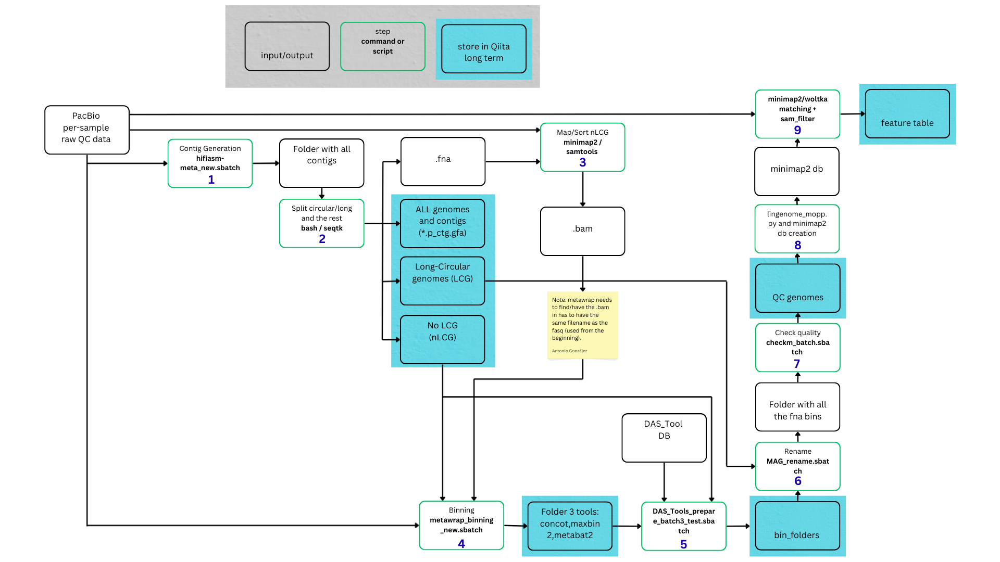

|Build Status| |Coverage Status|

Qiita plugin to process PacBio reads; it currently provides 2 commands for Qiita:

* **Woltka v0.1.7, with cov and id filter**: which generates feature and functional profiles agains WoLr2 using a coverage and identify filter;
  the expected output are BIOM artifacts.

* **PacBio processing**: which goes from step 1 to 7 in the image below. The expected output
  is a main folder with folders per-sample and folders for each of the different outputs, as follows:

  * **MAG** folder: all Metagenome-Assembled Genome (MAG) generated for that sample
  * **LCG** folder: all Long-Circular Genome (LCG) generated for that sample that are over 512kb in size - approximate 515,000 bases (half a million)
  * **small_LCG** folder: all Long-Circular Genome (LCG) generated for that sample that are under 512kb in size
  * **[sample-name].fna.gz**: the no LCG reads used for MAG generation
  * **[sample-name].checkm.txt.gz**: MAG quality information from CheckM v1.2.3

* **PacBio adapter removal via lima/pbmarkdup**: removes adapters via lima/pbmarkdup from per-sample-FASTQ artifacts. We currently have 2 adapter_sets:

  * 'AAGCAGTGGTATCAACGCAGAGTACT'
  * 'twist_adapters_231010.fasta.gz', downloaded from `PacBio <https://www.pacb.com/wp-content/uploads/Twist_Universal_Adapters_10bp_UDI_for_PacBio_10Oct2023.fasta_.zip>`__

* **Feature Table from LCG/MAG**: (only available for admins via CLI: `feature-table-job-submission.py`) creates a new Analysis
  with the merged LCG/MAG of 1 or multiple artifacts generated by the `PacBio processing` command - includes feature table, phylogeny and taxonomy

**[DEPRECATED commands]**

* **Woltka v0.1.7, minimap2**: which generates feature and functional profiles agains WoLr2;
    the expected output are BIOM artifacts

.. |Build Status| image:: https://github.com/qiita-spots/qp-pacbio/actions/workflows/qiita-plugin-ci.yml/badge.svg
   :target: https://github.com/qiita-spots/qp-pacbio/actions/workflows/qiita-plugin-ci.yml
.. |Coverage Status| image:: https://coveralls.io/repos/github/qiita-spots/qp-pacbio/badge.svg?branch=dev
   :target: https://coveralls.io/github/qiita-spots/qp-pacbio?branch=master
